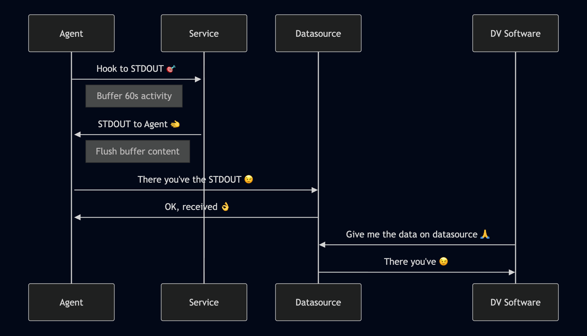
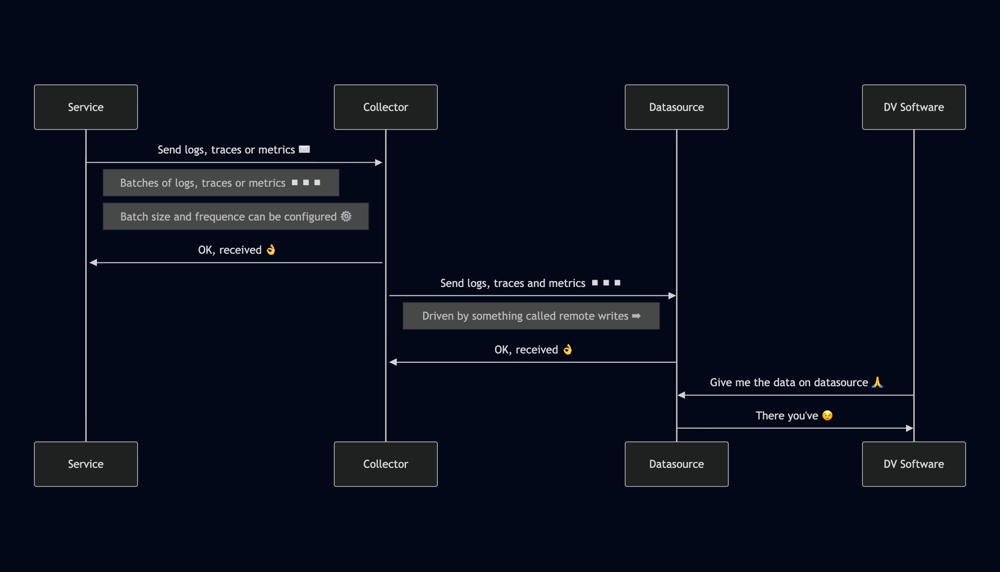

<!-- paginate: false -->
# Implementing OTEL in FastAPI

##### A brief introduction to OTEL and how to instrument FastAPI applications.

---
## Who am I ❓

- Name: **Roberto Garcia Navarro**
- Role: **Senior Backend Engineer & Architect @ _FACEPHI_**
- Experience: **10+ years in software development**
- Specialization: **Backend development, microservices, cloud computing, and observability**
- Tech stack: **Golang, Python, PHP, Node.js, Rust (WIP), Kubernetes, Docker**
- GitHub: **[@soulcodex](https://github.com/soulcodex)**
- Contact: **[info@soulcodex.es](mailto:info@soulcodex.es)**

---
## Topics of interest

- Observability
- Kubernetes
- Microservices
- Distributed systems
- APIs design and governance
- Domain-Driven Design (DDD) and Event Driven Architecture's (EDA)
- DevOps and CI/CD
- Serverless computing
- Software Architecture

---
## Topics to cover during the talk

- What's observability and which role plays OTEL? 
- Three main pillars of observability
- Observability pillars and its particularities
- OTEL 
  - Components 
  - Instrumentation strategies 
  - Collecting strategies
- How it looks like a good observability system?
- A simple FastAPI instrumentation to gather info and send it to Grafana using OTEL
- Q&A

---
## What's observability?

> Is the ability to understand a complex system's internal state by analyzing its external outputs (like logs, metrics and traces) to diagnose issues, optimize performance, and ensure reliability.

---
## What are the three main pillars of observability?

---
## Pillars of observability
- **Logs**: Structured records of events that provide context about system behavior.
- **Metrics**: Quantitative measurements that provide insights into system performance and health.
- **Traces**: Detailed records of requests as they flow through a system, showing the path and timing of each operation.

---
## How it looks like a good observability system?
- **Semantic Convention (semconv)**: Standardized naming and structure for logs, metrics, and traces to ensure consistency and interoperability.
- **Correlated Data**: The ability to link logs, metrics, and traces together for comprehensive analysis.
- **Contextual Information**: Enriching data with relevant context (e.g., user IDs, request IDs) to facilitate troubleshooting.
- **Real-time Monitoring**: The capability to monitor systems in real-time for immediate detection of issues.
- **Alerting**: The process of notifying relevant stakeholders when certain conditions are met, based on the analysis of logs, metrics, and traces.
- more...

---
## What's OTEL?

> OpenTelemetry (OTEL) is an open-source observability framework that provides a set of tools, APIs, and SDKs for collecting and exporting telemetry data (traces, metrics, and logs) from applications and services.

---
## Why OTEL?

- Vendor-neutral standard for observability data.
- Comprehensive support for traces, metrics, and logs.
- Wide range of integrations with popular frameworks and libraries.
- Active community and ongoing development.
- Facilitates better monitoring, debugging, and performance optimization.
- Supports distributed tracing for microservices architectures.

---
## Why semconv is important? - [Semantic Conventions](https://opentelemetry.io/docs/specs/semconv/)

- **Consistency**: Ensures that telemetry data follows a standardized format, making it easier to interpret and analyze.
- **Interoperability**: Facilitates integration between different observability tools and platforms.
- **Efficiency**: Reduces the effort required to instrument applications and services by providing predefined conventions.
- **Community Adoption**: Leverages widely accepted standards, promoting best practices in observability.
- **Cardinality Reduction**: Helps in reducing the number of unique metric names and labels, making it easier to manage and analyze metrics.
- more...

---
## OTEL components

- **API**: Defines the interfaces for collecting telemetry data.
- **SDK**: Provides implementations of the API for different programming languages.
- **Exporters**: Components that send collected telemetry data to various backends (e.g., Jaeger, Prometheus, Zipkin).
- **Instrumentation libraries**: Pre-built libraries for popular frameworks and libraries to simplify the process of adding telemetry to applications.
- **Collector**: A separate service that can receive, process, and export telemetry data from multiple sources.

---
## OTEL instrumentation strategies

- **Automatic Instrumentation**: Using pre-built instrumentation libraries to automatically collect telemetry data from popular frameworks and libraries without modifying application code.
- **Manual Instrumentation**: Adding custom instrumentation code to the application to collect specific telemetry data that is not covered by automatic instrumentation.

---
## OTEL collecting strategies

- **Pull-based Collection**: The OTEL Collector periodically pulls telemetry data from instrumented applications or services using defined protocols.

---
#### OTEL collecting strategies

<center></center>

---
## OTEL collecting strategies

- **Push-based Collection**: Instrumented applications or services push telemetry data directly to the OTEL Collector or other backends.
---
#### OTEL collecting strategies

<center></center>

---
## Typical OTEL collecting architecture

- Logs are collected through a pull-based strategy.
- Metrics and traces are collected through a push-based strategy.
- The OTEL Collector acts as a central hub for processing and exporting telemetry data.
- Data is sent to a backend observability platform such as Grafana
- Correlation between logs, metrics, and traces is achieved through consistent use of trace IDs and span IDs.

---
## Which one is a good log format or structure?

### 01 - Plain text

```text
[2023-10-01 12:00:00] INFO user-service v1.0.0 - user login successful | trace_id=4bf92f3577b34da6a3ce929d0e0e4736 span_id=00f067aa0ba902b7 user_id=12345 http_method=POST http_url=/login http_status_code=200 duration_ms=150
```
---
## Which one is a good log format?

### 02 - JSON

```json
{
  "correlation_id": "4bf92f3577b34da6a3ce929d0e0e4736",
  "timestamp": "2023-10-01T12:00:00Z",
  "level": "INFO",
  "service.name": "user-service",
  "service.version": "1.0.0",
  "trace_id": "4bf92f3577b34da6a3ce929d0e0e4736",
  "span_id": "00f067aa0ba902b7",
  "message": "user login successful",
  "user.id": "12345",
  "http.method": "POST",
  "http.url": "/login",
  "http.status_code": 200,
  "duration_ms": 150
}
```

---
## Why JSON is better?

- **Structured Data**: JSON provides a structured format that is easy to parse and analyze.
- **Rich Context**: JSON allows for the inclusion of additional metadata and context, making it easier to correlate logs with traces and metrics.
- **Compatibility**: JSON is widely supported by logging systems and observability tools, facilitating integration and analysis.
- **Flexibility**: JSON can easily accommodate changes in log structure without breaking existing systems.
- **Searchability**: JSON logs can be easily indexed and searched in log management systems.
- more...

---
## For what logs works?

- **Debugging**: Identifying and diagnosing issues in the application.
- **Auditing**: Tracking user actions and system changes for compliance and security.
- **Alerting**: Triggering notifications based on specific log events or patterns.
- **Usage Analytics**: Understanding user behavior and application usage patterns.
- more...

---
## Traces

- **Tracing** is the process of tracking a full request through a distributed system, capturing detailed information about each operation (span) involved in processing a request.
- **Advantages**:
  - Provides a comprehensive view of request flow.
  - Helps identify performance bottlenecks.
  - Facilitates root cause analysis of issues.
- **Disadvantages**:
  - Can introduce overhead in terms of performance and storage.
  - Requires careful instrumentation to ensure meaningful data is collected.
---
## Why traces over logs?

- **Holistic View**: Traces provide a complete picture of how requests flow through a system, while logs are often isolated events.
- **Performance Insights**: Traces can reveal latency and performance bottlenecks that may not be evident from logs alone.
- **Contextual Correlation**: Traces inherently link related operations, making it easier to understand the relationships between different components.
- **Reduced Noise**: Traces can help filter out irrelevant log data by focusing on specific requests or transactions.
- **End-to-End Visibility**: Traces offer visibility into the entire lifecycle of a request, from start to finish.
- more...

---
## Metrics

- **Metrics** are quantitative measurements that provide insights into the performance and health of a system.
- **Why they are useful?**
  - Enable monitoring of system performance.
  - Facilitate capacity planning and resource management.
  - Help identify trends and anomalies in system behavior.
  - Support alerting based on predefined thresholds.
- **Methods to collect metrics?**
  - Local service metrics endpoint
  - Prometheus
---
## Metrics meaning

- **Percentiles**: Statistical measures that indicate the value below which a given percentage of observations fall (e.g., 50th, 90th, 99th percentiles).
- **Averages**: The mean value of a set of measurements, providing a general overview of system performance.
- **Type of metrics**:
  - **Gauge** - represents a single numerical value that can go up and down in a specific point in time.
  - **Counter** - represents a cumulative value that only increases.
  - **Histogram** - samples observations and counts them in configurable buckets.
  - **UpDownCounter** - represents a value that can increase and decrease in a whole running application.
---
## Minimal aspects of a metric

- **Name**: A unique identifier for the metric that describes what is being measured.
- **Kind**: The type of metric (e.g., Gauge, Counter, Histogram, UpDownCounter).
- **Unit**: The unit of measurement for the metric (e.g., seconds, bytes, requests).
- **Description (Optional)**: A brief explanation of what the metric represents and its significance.

---
## Instrumenting a FastAPI application with OTEL

### Setting up the logger

---
```python
import os
import logging

from opentelemetry.sdk.resources import Resource

from settings import Config
from observability.logger import init_otel_logger
from observability.config import OTLPConfig, LoggerConfig, LogLevel, otlp_headers_from_env


def configure_logger(resource: Resource, cfg: Config) -> logging.Logger:
    logger_config = LoggerConfig(
        resource=resource,
        otlp_config=OTLPConfig(
            endpoint=cfg.otel.otlp_endpoint,
            insecure=cfg.otel.otlp_insecure,
            headers=otlp_headers_from_env({}, cfg.otel.otlp_headers),
        ) if cfg.otel.log_exporter == "otlp" and cfg.otel.otlp_enabled else None,
        name=cfg.app.app_name,
        level=LogLevel.from_str(cfg.logger.level),
        formatter=logging.Formatter(os.getenv("OTEL_PYTHON_LOG_FORMAT", cfg.logger.format)),
    )

    return init_otel_logger(logger_config)
```
---
## Instrumenting a FastAPI application with OTEL

### Setting up the traces provider
---

```python
import os
import logging

from opentelemetry.sdk.resources import Resource
from opentelemetry.sdk.trace import TracerProvider

from settings import Config
from observability.trace_provider import init_otel_trace_provider
from observability.config import OTLPConfig, TracerConfig, otlp_headers_from_env


def configure_trace_provider(resource: Resource, cfg: Config) -> TracerProvider:
  tracer_config = TracerConfig(
    resource=resource,
    otlp_config=OTLPConfig(
      endpoint=cfg.otel.otlp_endpoint,
      insecure=cfg.otel.otlp_insecure,
      headers=otlp_headers_from_env({}, cfg.otel.otlp_headers),
      batched=cfg.otel.traces_batched,
    ) if cfg.otel.otlp_enabled and cfg.otel.exporter == "otlp" else None,
  )

  return init_otel_trace_provider(tracer_config)
```
---
## Instrumenting a FastAPI application with OTEL

### Setting up the metrics provider
---

```python
import os
import logging

from fastapi import FastAPI
from opentelemetry.sdk.resources import Resource
from opentelemetry.sdk.metrics import MeterProvider

from settings import Config
from metrics_router import metrics_router
from observability.meter_provider import init_otel_meter_provider
from observability.config import OTLPConfig, MeterConfig, otlp_headers_from_env


def configure_meter_provider(app_instance: FastAPI, resource: Resource, cfg: Config) -> MeterProvider:
    meter_config = MeterConfig(
        resource=resource,
        otlp_config=OTLPConfig(
            endpoint=cfg.otel.otlp_endpoint,
            insecure=cfg.otel.otlp_insecure,
            headers=otlp_headers_from_env({}, cfg.otel.otlp_headers),
        ) if cfg.otel.metric_exporter == "otlp" and cfg.otel.otlp_enabled else None,
        enable_prometheus_reader=cfg.otel.prometheus_enabled,
    )

    meter_provider, prometheus_reader = init_otel_meter_provider(meter_config)
    if prometheus_reader is not None:
        app_instance.include_router(metrics_router)

    return meter_provider
```
---
## Instrumenting a FastAPI application with OTEL

### Setting up the FastAPI app with OTEL
---
```python
def create_app() -> FastAPI:
    cfg = get_config()
    app_instance = FastAPI(title=cfg.app.doc_title, version=cfg.app.app_version)

    resource = ResourceBuilder.new(). \
        with_name(cfg.app.app_name). \
        with_version(cfg.app.app_version). \
        with_namespace(cfg.otel.service_namespace). \
        with_environment(cfg.app.environment). \
        build()

    trace_provider = configure_trace_provider(resource, cfg)
    meter_provider = configure_meter_provider(app_instance, resource, cfg)
    logger = configure_logger(resource, cfg)

    FastAPIInstrumentor().instrument_app(
        app=app_instance,
        tracer_provider=trace_provider,
        meter_provider=meter_provider,
    )
    logger.info("service started...")
    return app_instance
```
---
## Adding a prometheus endpoint to expose metrics

```python
def configure_meter_provider(app_instance: FastAPI, resource: Resource, cfg: Config) -> MeterProvider:
    ... # previous code
    meter_provider, prometheus_reader = init_otel_meter_provider(meter_config)
    if prometheus_reader is not None:
        app_instance.include_router(metrics_router)
    ... # rest of the code
```

```python
from fastapi import APIRouter, Response
from prometheus_client import generate_latest, CONTENT_TYPE_LATEST

metrics_router = APIRouter()


@metrics_router.get("/metrics")
def get_metrics(response: Response):
    response.headers["Content-Type"] = CONTENT_TYPE_LATEST
    return generate_latest()
```
---
## Which kind of things we can monitor with OTEL in FastAPI?

- **HTTP Requests**: Monitor incoming requests, response times, status codes, and error rates.
- **Database Queries**: Track database interactions, query performance, and error rates.
- **External API Calls**: Monitor calls to third-party services, including latency and failure rates.
- **Custom Business Logic**: Instrument specific business processes or workflows to gather performance metrics and traces.
- **Resource Utilization**: Collect metrics on CPU, memory, and other resource usage of the application.
- more...

---
## Q&A

- Thank you for your attention!
- Any questions?
---
## Get the source code

<center></center>